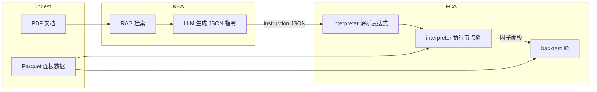

# FactorGenAgent

面向量化因子研究的智能体流水线：从 PDF 文档中检索相关知识，由大语言模型（LLM）生成**严格受约束的因子表达式**，再在面板数据上**解析、执行**并可选计算**横截面 IC（Pearson）**。

---

## 架构总览



**数据流简述**

1. **KEA**（`KnowledgeExtractAgent`）：读 PDF → 文本切块 → 向量检索（RAG）→ 调用 LLM，输出因子 JSON（含 `expression` 等）。
2. **FCA**（`FactorConstructAgent`）：读 Parquet 面板 → 用 `interpreter` 将 `expression` 解析为内部节点树 → 在数据上执行 → 得到每个因子的面板结果；`backtest` 用 `ChangeRatio` 计算逐日 IC。
3. **main**：串联 KEA → FCA；若 FCA 返回 `ok: false`，将 `feedback` 回传给下一轮 KEA。

**错误与重试**

- 多处异常会调用 `utils/error_utils.record_error_event`，追加写入项目根目录下的 **`error_events.jsonl`**（JSON Lines，一行一个事件）。
- FCA 在解析/执行失败时返回 `feedback`（由 `build_retry_feedback` 生成），供 main 回灌 KEA。

---

## 目录与文件说明

### 入口与编排

| 路径 | 作用 |
|------|------|
| [`main.py`](main.py) | 编排 `KEA` → `FCA` 的循环；FCA 失败时把 `feedback` 传给下一轮 KEA；成功时汇总 `factor_name`、`instruction` 子项、`df_factor`、`backtest`。 |
| [`main.ipynb`](main.ipynb) | Notebook 实验/演示（非运行必需）。 |

### 智能体（`agents/`）

| 路径 | 作用 |
|------|------|
| [`agents/KnowledgeExtractAgent.py`](agents/KnowledgeExtractAgent.py) | **KEA**：加载 `configs/fields.json` 与 `configs/operators.json` 注入 system prompt；`extract_knowledge` 完成 PDF+RAG+LLM，解析 JSON 返回 instruction。`feedback` 拼入 **user 侧内容**。 |
| [`agents/FactorConstructAgent.py`](agents/FactorConstructAgent.py) | **FCA**：`handle_instruction` 解析并执行表达式；`backtest` 计算 Pearson IC（因子与下一期收益对齐）。 |
| [`agents/__init__.py`](agents/__init__.py) | 包初始化占位。 |

### 工具与解释器（`utils/`）

| 路径 | 作用 |
|------|------|
| [`utils/tools.py`](utils/tools.py) | `read_pdf`（pdfplumber）、`rag_search`（分块 + SentenceTransformer 编码 + Faiss 检索）、`call_llm_api`（OpenAI 兼容客户端调用网关）。异常时记录 `error_events.jsonl` 后重新抛出。 |
| [`utils/interpreter.py`](utils/interpreter.py) | **表达式解释器**：`parse_expression_to_node`（AST → 内部节点字典）、`execute_node`（在 DataFrame 上按算子递归计算）。字段/算子白名单来自 `configs/*.json`。执行层 pivot 使用 **`Trddt` / `Stkcd`**（与 FCA、回测一致）。 |
| [`utils/error_utils.py`](utils/error_utils.py) | 统一错误日志：`record_error_event`、`build_retry_feedback`；日志文件为项目根目录 **`error_events.jsonl`**。 |
| [`utils/__init__.py`](utils/__init__.py) | 包初始化占位。 |

### 配置（`configs/`）

| 路径 | 作用 |
|------|------|
| [`configs/fields.json`](configs/fields.json) | 允许出现在因子表达式中的**数据字段**及英文说明（如 `Stkcd`、`Trddt`、`Clsprc`、`ChangeRatio` 等）。KEA 的 prompt 会嵌入该 JSON；`interpreter` 启动时加载，**表达式里的 `Name` 必须属于这些 key**。 |
| [`configs/operators.json`](configs/operators.json) | 允许的**算子**及 `signature`、说明；用于 AST 解析时的 arity 推断与约束。 |

### 本地模型与向量缓存（`hub/`）

| 路径 | 作用 |
|------|------|
| [`hub/`](hub/) | **本仓库内的 SentenceTransformer / Hugging Face Hub 风格本地模型目录**，供 KEA 的 RAG 阶段加载嵌入模型。使用 `BAAI/bge-m3` 从 Hugging Face 或 https://cloud.tsinghua.edu.cn/d/9a6da85cc45c46ea9e79/ 下载后放入此目录下。 |


### 其他

| 路径 | 作用 |
|------|------|
| [`.vscode/settings.json`](.vscode/settings.json) | VS Code / Cursor 本地 Python 环境相关设置。 |
| [`data/`](data/) | 放置示例 PDF、Parquet 等数据。 |
| [`error_events.jsonl`](error_events.jsonl) | 运行期由 `utils/error_utils.py` 追加写入的统一错误事件日志（项目根目录）。 |

---

## 数据

### Parquet（FCA 默认示例数据 `/data/stock_data.parquet`）

- **完整日频量价数据**：https://cloud.tsinghua.edu.cn/d/9a6da85cc45c46ea9e79/
- **长表**：每行一只股票在一个交易日的观测。
- **执行与回测当前实现依赖的列名**（与 `interpreter` / `FCA.backtest` 一致）：
  - `Trddt`：交易日期  
  - `Stkcd`：证券代码  
  - 因子表达式中引用的字段名须与 **`configs/fields.json` 的 key** 一致，且 Parquet 中需存在对应列（例如 `Clsprc`、`ChangeRatio` 等）。  
- **回测**：`FCA.backtest` 使用 `ChangeRatio` pivot 成宽表，再 **`shift(-1)`**，表示用 **t 日因子值** 与 **t+1 日收益** 做横截面 Pearson 相关，得到按 `Trddt` 的 **IC 序列**。

---

## `main.py` 参数说明

### `run_pipeline(...)`

| 参数 | 类型 | 默认值 | 含义 |
|------|------|--------|------|
| `pdf_path` | `str` | （必填） | 传给 KEA 的 PDF 路径（如 `data/sample1.pdf`）。 |
| `query` | `str` | （必填） | RAG 与任务描述用查询文本。 |
| `model` | `str` | `"DeepSeek-V3.2"` | LLM 名称，须为 `utils/tools.call_llm_api` 白名单之一。 |
| `max_rounds` | `int` | `5` | KEA→FCA 外层重试轮数；FCA 持续 `ok: false` 时最多重试次数。 |

**内部固定项（当前代码）**

- `KEA()`：无额外构造参数。  
- `FCA(parquet_path="/data/stock_data.parquet")`：面板数据路径写死在 `run_pipeline` 内；若需可配置，应改为函数参数或环境变量（可自行扩展）。

### `main()` 中示例调用

当前 `main()` 使用：

- `pdf_path="data/sample1.pdf"`
- `query="construct a factor"`
- `model="DeepSeek-V3.2"`
- `max_rounds=5`

### `run_pipeline` 返回值（当前实现）

- **成功且 FCA `ok: true`**：`{"ok": true, "results": [ ... ]}`  
  每个元素包含：`factor_name`、`instruction`（该因子对应的 dict）、`df_factor`（该因子堆叠后的 DataFrame）、`backtest`（IC 序列 `pd.Series`）。
- **`no_factor`**：`{"ok": true, "message": "...", "instruction": ...}`
- **失败**：`{"ok": false, "error": "...", "last_instruction": ..., "last_fca_result": ...}`


---

## 依赖与环境（概览）

运行前需自行安装 Python 依赖，典型包括：

- `pandas`、`numpy`、`pdfplumber`、`faiss-cpu`（或 `faiss-gpu`）、`langchain-text-splitters`、`openai`、`sentence-transformers`  
- **本地向量模型**：默认使用项目内 [`hub/`](hub/) 下的完整模型目录。
**安全提示**：`utils/tools.py` 内含 API 密钥与网关地址，生产环境应改为环境变量或配置文件，且勿提交到公开仓库。

---

## 快速运行

在项目根目录执行（需已配置好依赖、数据与模型路径）：

```bash
python main.py
```

---
